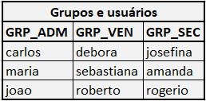
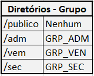

## Exemplo de Script para criação de Estrutura de Usuários, Diretórios e Permissões no Linux

 

* O script em usersStructure.sh cria os seguintes grupos e usuários:

    

* Os seguintes diretórios também são criados:

    

* Somente terão acesso aos diretórios os usuários que estão no grupo especificado em cada pasta. Com excessão somente da pasta "/publico"

* O script em "deleteUsers.sh" desfaz as alterações feitas por "usersStructure.sh"